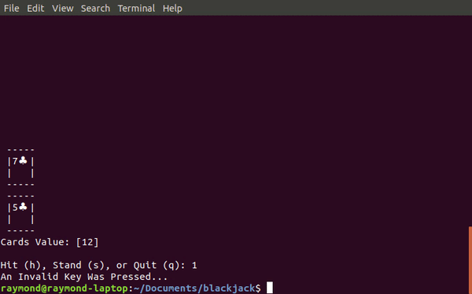

# Blackjack (In Terminal)
A terminal based game of blackjack using python. Tested on Python 2 and Python 3 on the Ubuntu 18 Linux Distribution. The objective of the game is to get a set of cards to a value as close to 21 as possible. J, Q, K are all worth a value of 10, while A is worth either 1 or 11.



## Downloading The Game
Click the "Clone or download" button on the github repository, download zip, and unzip the files on your computer. If you have git installed, you can instead download the files via git clone:
```bash
https://github.com/808brick/terminal-blackjack.git
```


## Running The Game
To run the game, open a terminal and navigate to the directory which the `blackjack.py` file is located. Then simply run the script with the python command:

```bash
cd path/to/blackjack
python blackjack.py
```

where `path/to/blackjack` is replaced with the actual directory path to the blackjack files.
